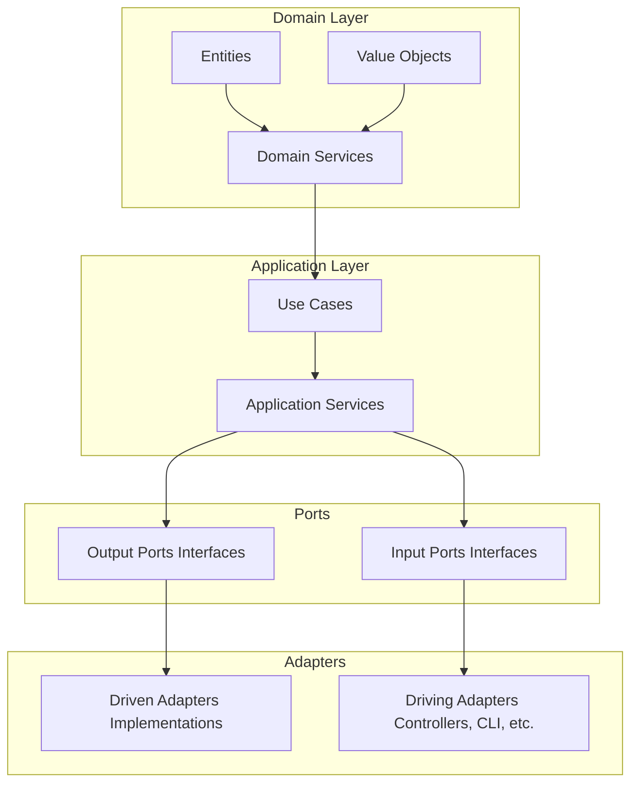

# 🚀 Java WebFlux Hexagonal Archetype

Arquetipo empresarial basado en **Spring Boot + WebFlux**, aplicando principios de **Clean Code**, **Arquitectura Hexagonal (Ports & Adapters)** y diseñado para integrarse con **AWS y Azure** mediante Driven Adapters desacoplados.

---

## 🧠 Filosofía del Proyecto

Este arquetipo promueve:

- ✅ Arquitectura Hexagonal (Ports & Adapters)
- ✅ Clean Architecture
- ✅ Programación Reactiva (Project Reactor)
- ✅ Separación estricta de responsabilidades
- ✅ Testabilidad real
- ✅ Desacoplamiento del framework
- ✅ Orientación Cloud Native (AWS & Azure)
- ✅ Diseño Cloud Agnostic

---

## 🏗 Arquitectura



---

## 📂 Estructura del Proyecto

```
│
├── domain
│   ├── model
│   └── ports
│       ├── inbound
│       └── outbound
│
├── applications
│   ├── app-service
│   └── use-case
│
└── infrastructure
    ├── driven-adapters
    │   ├── external-api
    │   ├── grpc
    │   ├── database
    │   ├── messaging
    │   └── event
    │
    ├── helpers
    │
    └── entry-points
        ├── reactive-web
        ├── cli
        └── scheduler
 
```

---

## ⚙️ Stack Tecnológico

- ☕ Java 21+
- 🌱 Spring Boot 3+
- ⚡ Spring WebFlux
- 🔄 Project Reactor
- 🧪 JUnit 5 + Mockito
- 🐳 Docker
- ☁ AWS SDK v2
- ☁ Azure SDK
- 🔐 Spring Security (opcional)
- 📦 Gradle / Maven

---

## 🔌 Driven Adapters Cloud

Este arquetipo incluye plantillas desacopladas para:

### ☁ AWS

- DynamoDB
- S3
- SNS
- SQS
- Lambda
- API Gateway
- Secrets Manager
- Parameter Store
- EventBridge

### ☁ Azure

- Cosmos DB
- Blob Storage
- Service Bus
- Azure Functions
- Key Vault
- Event Grid

Todos implementados como **Adapters que implementan puertos del dominio**, nunca dependencias directas en la capa de negocio.

---

## 🎯 Principios Aplicados

### 🔹 Dependency Rule
Las capas internas no dependen de las externas.

### 🔹 Reactive First
Todos los puertos usan `Mono<T>` y `Flux<T>`.

### 🔹 Clean Code
- Nombres semánticos
- Métodos pequeños
- Sin lógica en controladores
- Sin lógica en adapters
- Sin lógica de infraestructura en dominio

### 🔹 Cloud Agnostic
El dominio no sabe si está en AWS o Azure.

---

## 🧩 Ejemplo de Puerto (Outbound)

```java
public interface RetrieveUserPort {
    Mono<User> findById(String id);
}
```

```java
@Service
public class RetrieveUserUseCase {

    private final RetrieveUserPort retrieveUserPort;

    public RetrieveUserUseCase(RetrieveUserPort retrieveUserPort) {
        this.retrieveUserPort = retrieveUserPort;
    }

    public Mono<User> execute(String id) {
        return retrieveUserPort.findById(id);
    }
}
```

---

## 🧩 Ejemplo de Adapter (AWS DynamoDB)

```java
@Repository
public class DynamoDBUserAdapter implements RetrieveUserPort {

    private final DynamoDBClient dynamoDBClient;

    public DynamoDBUserAdapter(DynamoDBClient dynamoDBClient) {
        this.dynamoDBClient = dynamoDBClient;
    }

    @Override
    public Mono<User> findById(String id) {
        // Lógica para consultar DynamoDB y mapear a User
    }
}
```

---

## 🧩 Ejemplo de Adapter

```java
@Component
public class DynamoUserAdapter implements RetrieveUserPort {

    private final DynamoDbAsyncClient client;

    public DynamoUserAdapter(DynamoDbAsyncClient client) {
        this.client = client;
    }

    @Override
    public Mono<User> findById(String id) {
        return Mono.fromFuture(
                client.getItem(builder -> builder.tableName("users"))
        ).map(this::mapToDomain);
    }

    private User mapToDomain(GetItemResponse response) {
        return new User(...);
    }
}
```

---

## 🧪 Testing Strategy

- Unit tests en Domain y UseCases
- Adapter tests con Testcontainers
- Contract tests para APIs
- WebTestClient para capa REST
- StepVerifier para testing reactivo

---

## 🐳 Docker

```dockerfile
FROM openjdk:21-jdk-slim
WORKDIR /app
COPY build/libs/*.jar app.jar
EXPOSE 8080
ENTRYPOINT ["java", "-jar", "app.jar"]
```

```bash
docker build -t webflux-hexagonal .
docker run -p 8080:8080 webflux-hexagonal
```

## 🚀 Despliegue

- AWS: Elastic Beanstalk, ECS, Lambda
- Azure: App Service, AKS, Functions
- CI/CD: GitHub Actions, Jenkins, GitLab CI
- Infraestructura: Terraform, CloudFormation, ARM Templates
- Observabilidad: CloudWatch, Azure Monitor, Prometheus, Grafana
- Seguridad: IAM, RBAC, Secrets Manager, Key Vault
- Escalabilidad: Auto Scaling, AKS Horizontal Pod Autoscaler
- Resiliencia: Circuit Breaker, Retry, Bulkhead (Resilience4j)
- Cost Optimization: Right-sizing, Spot Instances, Serverless
- Cloud Agnostic: Terraform, Crossplane, Kubernetes
- Multi-Cloud: Terraform, Crossplane, Kubernetes

---

## 📌 Casos de Uso Ideales

- Microservicios empresariales
- Arquitecturas Event Driven
- Serverless Backends
- Integraciones multi-cloud
- Gateways de transformación
- APIs BFF reactivas
- Arquitecturas Clean Architecture reales

---

## 🧠 ¿Por qué este arquetipo?

Porque la mayoría de proyectos:

- Mezclan dominio con infraestructura
- Acoplan negocio a AWS o Azure
- Usan WebFlux pero bloquean (.block())
- No respetan la Dependency Rule
- No separan correctamente los puertos
- Este repositorio soluciona eso desde la base.

---

## 🤝 Contribuciones

Pull Requests bienvenidos.

Reglas:
- No violar la arquitectura hexagonal
- No introducir dependencias en dominio
- Mantener estilo reactivo
- Seguir principios Clean Code

---

📜 Licencia

MIT License

